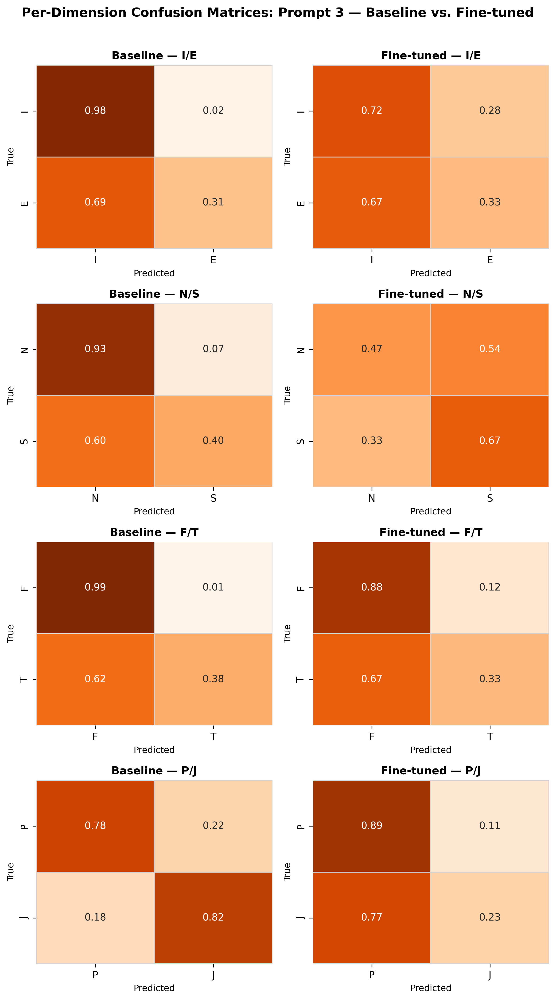
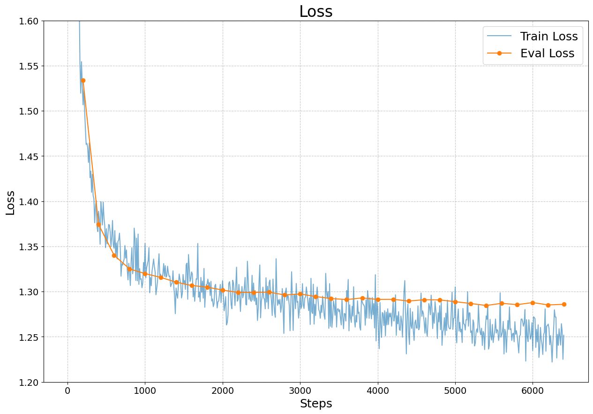
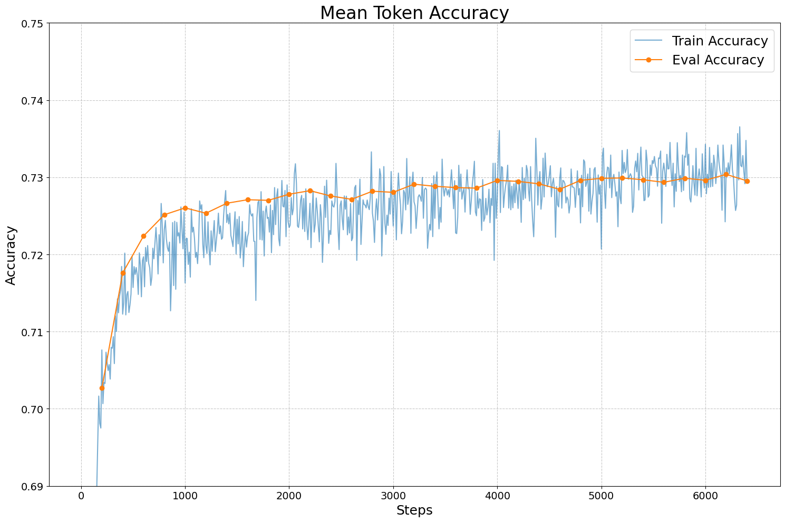

# Grade: A
____________________________________________________________________________________________
# Master thesis project: Personality-Aware LLM-based Dialogue Simulation for Pedestrians

The goal is to fine-tune an LLM for personality-based dialogue generation for social simulation purposes. 

### Description
Social simulation is used to study interactions, scenarios or societal patterns in a experimental environments, that are difficult to study in real life for various reasons. LLMs bring the potential to change how simulations are conducted, possibly replacing or enhancing rule-based simulation approaches.
One way simulation can be enhanced is by generating synthetic but realistic conversations that can make simulation more credible and introduce new facets of interaction. 

This project aims to fine-tune an LLM to do exactly that: to generate realistic, scenario-based dialogue between simulated agents in multi-agent simulations. To make it more realistic, this dialogue should convey the personality of the speaker. 
Therefore the fine-tuning is conducted using a dataset of foum posts, labelled with the Myers-Briggs Type Indicator (MBTI). 

### Methodology
#### Data
I created a custom dataset made up of a Kaggle MBTI dataset and the DailyDialog dataset.
Kaggle dataset: [Kaggle MBTI](https://www.kaggle.com/datasets/datasnaek/mbti-type)
Cleaned and augmented dataset: [MBTI_balanced](https://huggingface.co/datasets/DrinkIcedT/mbti_balanced)

#### Data Preparation
##### Kaggle MBTI data
The kaggle dataset is cleaned and preprocessed with a common NLP cleaning pipeline, see [Preparation Notebook](notebooks/exploration_and_preprocessing.ipynb)

Since the dataset is heavily unbalanced, I needed to oversample as well as undersample, see [Augmentation Notebook](notebooks/data_augmentation.ipynb)
The evaluation of the augmented data was done [here](notebooks/augmented_data_eval.ipynb) and [here](notebooks/PerplexityScore.ipynb)

The following metrics for the evaluation were calculated:
- BLEU
- Self-BLEU
- TTR
- Perplexity
- Cosine Similarity

##### DailyDialog data
To prepare the DailyDialog data, it had to be labelled with MBTI labels. Otherwise, without keeping the model to predict MBTI labels, I might risk domain shifting. To label the data I traained 4 binary [RoBERTa classifiers](alvis_backup/Scripts/roberta_classifier_single.py), one for each binary MBTI dimension.

The labelled Dailydialog dataset and the Kaggle dataset were then merged and transformed using the chat template for the Qwen 2.5 model family.

#### Model Selection and Finetuning
Model: [Qwen2.5-7B-Instruct](https://huggingface.co/Qwen/Qwen2.5-7B-Instruct)
Fine-tuning was done on the Alvis HPC cluster from Chalmers as part of the National Academic Infrastructure for Super­computing in Sweden ([NAISS](https://www.naiss.se/))

#### Evaluation
The performance of the fine-tuned model was comparatively tested against the performance of a baseline model, which in this case is simply the non-fine-tuned version of the model.

The models are evaluated using a two-step evaluation pipeline. First, both models generated datasets of 500 utterances, based on a range of prompts and ground truth labels. These datasets were then classified using the four binary RoBERTa classifiers. Accuracy, recall and F1 scores were calculated to assess the performance.

Then in a second step, a range of dialogues based on three different simulation scenarios were generated, with two models acting as the participants of a simulated dialogue in the respective scenario. Then, an LLM-as-Judge approach was used to evaluate the generated dialogues, employing GPT-5.1, Sonnet-4.6 and Gemini 2.5 Flash. The models are asked to perform a simplified version of a qualitative textual content analysis, as it is common for example in the social sciences. The MBTI types work as a codebook, on which the deductive coding of the dialogues is performed. The judging models look for hints of the MBTI types and then, based on their reasoning, decide on the MBTI type of the speaker.

### Results
#### RoBERTa Classification
Compared to other MBTI classifiers, my RoBERTa classifiers (see my [HugginFace](https://huggingface.co/DrinkIcedT)) rank in the lower middle of the field. Most likely, the heavy imbalance of the dataset impaired their performance, although augmentation and threshold tuning were applied. The classifiers seem to be biased towards certain dimensions, as can be seen in the [figures](figs/) One explanation could be, that the strong augmentation degraded data quality too much, which should be assessed in future experiments.

Recall visualisation, showing bias:

#### Model Fine-Tuning
The final model can be downloaded [here](https://huggingface.co/DrinkIcedT/Qwen2.5-7B-Instruct_MBTI-Dialogues_modifiedprompt)

Loss and Token Accuracy:

Rest of the results will be updated soon!

